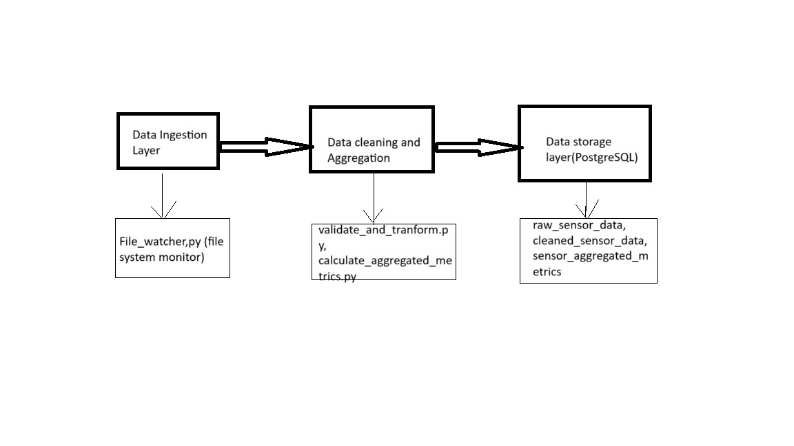

Data pipeline Documentation

1. Architecture and Design of Datapipeline
    - The pipeline is designed to monitor a folder C:\\Jupyter Notebook\\data for incoming CSV files,
    process the data with cleaning and transformation and store the result in database.
    - The code uses Python libraries such as watchdog for monitoring the files, pandas for data manipulation and processing, tenacity for retry mechanisms.

    -Architecture diagram
        
    1. Data Ingestion layer
        The Data Ingestion Layer is responsible for monitoring the folder C:\\Jupyter Notebook\\data for incoming CSV files. The watchdog library is used to watch this folder and trigger processing when a new file is created.
        - Watchdog: Used to detect when new files are created in the specified directory.
        - File Event Handler: The MyHandler class is a FileSystemEventHandler that is triggered when new files are created in the monitored directory.
        - Threading : Used for concurrent processing of files if multiple files are received at the same time in the folder.
        - Retry Mechanism: The tenacity library is used to implement a retry mechanism in case of  errors during file processing.
    2. Data Processing layer
        This layer performs the transformation of raw data like validation, cleaning, handling missing values, aggregation.
        - Validate and Transform: The validate_and_transform function is used to clean the data (e.g., handle missing values, check for valid temperature readings).
        - Aggregate Data: The calculate_aggregated_metrics function computes metrics such as min, max, average, and standard deviation for sensor data and tags the data with more information.
    3. Data Storage layer
        The Data Storage Layer stores processed data in a PostgreSQL database for easy querying and analysis. Two primary tables are used:
        - Raw Sensor Data: Stores raw data before cleaning.
        - Cleaned Sensor Data: Stores cleaned and transformed data.
        - Aggregated Metrics: Stores aggregated metrics (e.g., average temperature, min, max, std) for each sensor.
        - Database: The processed data is stored in a PostgreSQL database.
            - Tables: raw_sensor_data, cleaned_sensor_data, and sensor_aggregated_metrics.
    4. Error Handling and Logging
        - Logging: The pipeline uses Python's logging module to log the operations and capture errors.
        - Error Handling: When an error occurs (e.g., file parsing error or database issue), the pipeline logs the error and retries the operation up to 3 times with a 5-second wait between retries.

